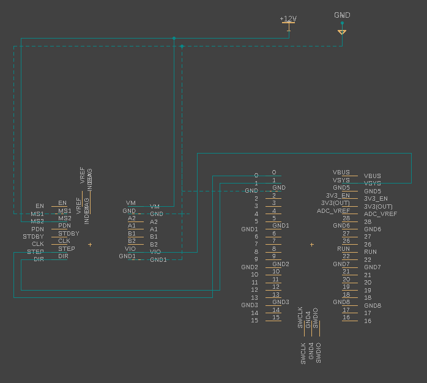

# Testing NEMA 17 Stepper with Raspberry Pi Pico

Learning how to wire a stepper directly to pico. I found a circuit python example from [adafruit](https://learn.adafruit.com/diy-robotic-sky-tracking-astrophotography-mount/code) and am attempting to get it to step using micropython. So far I've wired everything on the breadboard and wrote the following code. The stepper is holding position, but when directed does not. Any help appreciated.  

## Hardware Components
- [TMC2226 Driver TMC2226 V1.0 Stepper Motor Driver UART Mode](https://www.amazon.com/gp/product/B08BZ819R6/ref=ppx_yo_dt_b_asin_title_o06_s01?ie=UTF8&psc=1)
- Raspberry Pi Pico

## Wiring

A1, A2, B1, and B2 are wired to a NEMA 17 motor.

